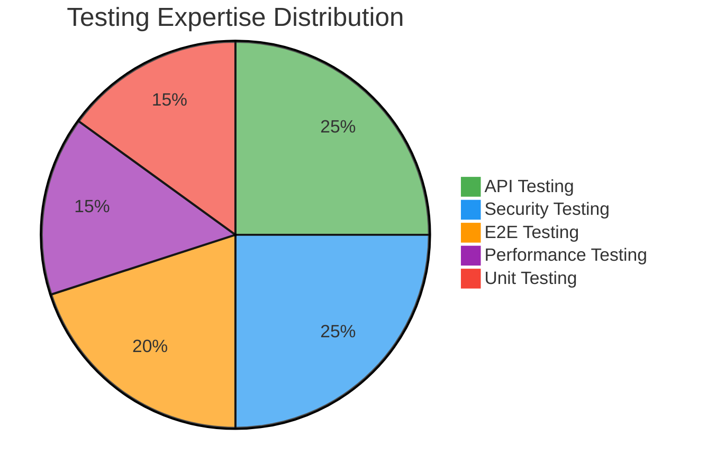
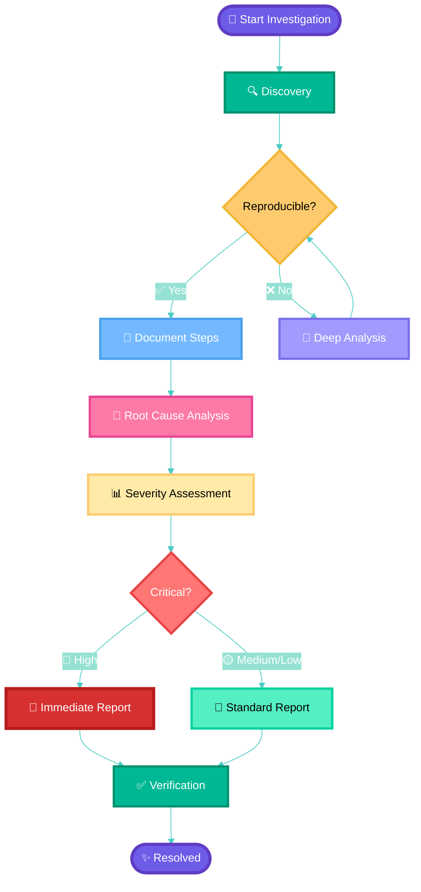

<div align="center">
  
</div>

<p align="center">
  
  
  
</p>

---

## 🔍 About Me


- 🔒 **Security Testing** 
  - Penetration testing
  - OWASP Top 10
  - Vulnerability assessment
  
- ✅ **QA Engineering**
  - Automated testing
  - API and E2E testing
  - Performance testing

- 🐛 **Bug Hunter**
  - Complex bug reproduction
  - Detailed reporting

- 🧪 **Test Automation**
  - Python (pytest)
  - JavaScript (Jest, Playwright, Cypress)

<br clear="right"/>

---

## 🛠️ Tech Stack

<div align="center">

### Languages


### Testing Frameworks


### Security Tools


### DevOps and Tools


</div>

---

## 💼 Core Competencies

<table align="center">
<tr>
<td width="50%" valign="top">

### 🧪 Software Quality Assurance
```text
Unit Testing         ████████████████░ 95%
Integration Testing  ███████████████░░ 90%
E2E Testing          ████████████████░ 95%
API Testing          █████████████████ 98%
Performance Testing  ██████████████░░░ 85%
Test Automation      ████████████████░ 95%
```

</td>
<td width="50%" valign="top">

### 🔐 Security Testing
```text
Penetration Testing  ███████████████░░ 90%
Vulnerability Assess ████████████████░ 95%
OWASP Top 10        █████████████████ 98%
Exploit Development  ██████████████░░░ 85%
Security Reviews     ███████████████░░ 90%
CTF / Bug Bounty     █████████████░░░░ 80%
```

</td>
</tr>
</table>

---

## 📊 Expertise Breakdown

<div align="center">



</div>

---

## 🎯 Current Focus

<div align="center">

| 🔭 Project | 📝 Description |
|-----------|---------------|
| **Security Testing Framework** | Building automated security scanning tools |
| **Cloud Security** | AWS, GCP, Azure security testing |
| **Custom Tools** | Developing testing utilities and scripts |
| **CTF Challenges** | Participating in security competitions |

</div>

---

## 🏆 Testing Approach

```mermaid
%%{init: {'theme':'base', 'themeVariables': { 'primaryColor':'#4CAF50', 'primaryTextColor':'#fff', 'primaryBorderColor':'#4CAF50', 'lineColor':'#2196F3', 'secondaryColor':'#FF9800', 'tertiaryColor':'#9C27B0', 'fontSize':'16px'}}}%%
flowchart LR
    A[📋 Requirements] -->|Analyze| B[📝 Test Planning]
    B -->|Design| C[🎨 Test Cases]
    C -->|Automate| D[🤖 Test Scripts]
    D -->|Run| E[▶️ Execution]
    E -->|Report| F[🐛 Bug Tracking]
    F -->|Verify| G[✅ Regression]
    G -->|Continuous| E
    
    style A fill:#4CAF50,stroke:#2E7D32,stroke-width:3px,color:#fff
    style B fill:#2196F3,stroke:#1565C0,stroke-width:3px,color:#fff
    style C fill:#FF9800,stroke:#E65100,stroke-width:3px,color:#fff
    style D fill:#9C27B0,stroke:#6A1B9A,stroke-width:3px,color:#fff
    style E fill:#F44336,stroke:#C62828,stroke-width:3px,color:#fff
    style F fill:#E91E63,stroke:#AD1457,stroke-width:3px,color:#fff
    style G fill:#00BCD4,stroke:#00838F,stroke-width:3px,color:#fff
```

<div align="center">



</div>

---

## 🔥 Skills Matrix

<div align="center">

| Category | Skills | Level |
|----------|--------|-------|
| **Languages** | Python, JavaScript, TypeScript, Java, Bash | ⭐⭐⭐⭐⭐ |
| **Test Automation** | Pytest, Jest, Playwright, Cypress, Selenium | ⭐⭐⭐⭐⭐ |
| **Security** | Burp Suite, OWASP, Metasploit, Penetration Testing | ⭐⭐⭐⭐⭐ |
| **API Testing** | Postman, REST, GraphQL, Contract Testing | ⭐⭐⭐⭐⭐ |
| **Performance** | k6, JMeter, Load Testing, Stress Testing | ⭐⭐⭐⭐ |
| **DevOps** | Docker, Jenkins, GitHub Actions, CI/CD | ⭐⭐⭐⭐ |

</div>

---

## 🐛 Bug Hunting Process

<div align="center">



</div>

---

## 📫 Connect With Me

<p align="center">
  <a href="mailto:jobzakung@protonmail.com">
    
  </a>
  <a href="https://github.com/Jobzakung">
    
  </a>
</p>

---

<div align="center">

### 💭 Testing Philosophy

> *"Quality is not an act, it is a habit."* - Aristotle

**Shift-Left Testing** • **Security by Design** • **Automation First** • **Continuous Improvement**

</div>

---

<div align="center">
  
</div>
